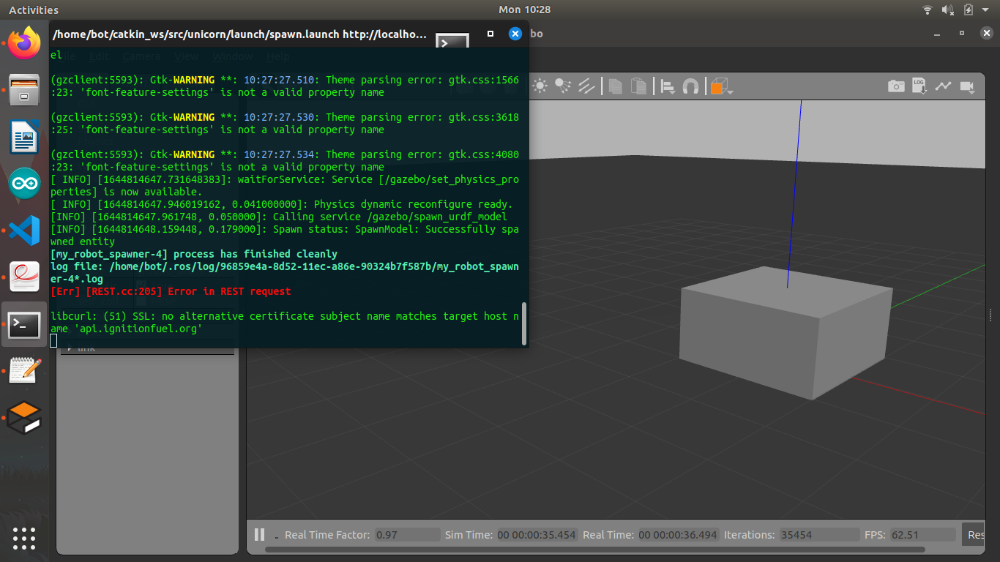
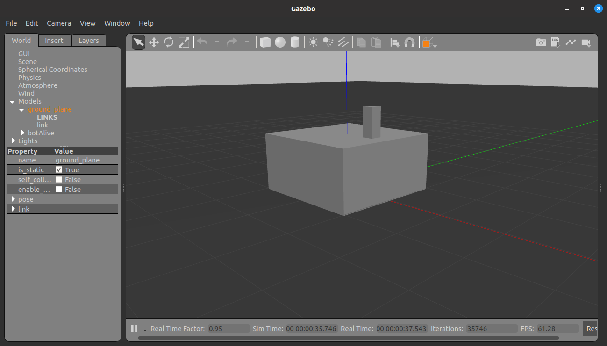
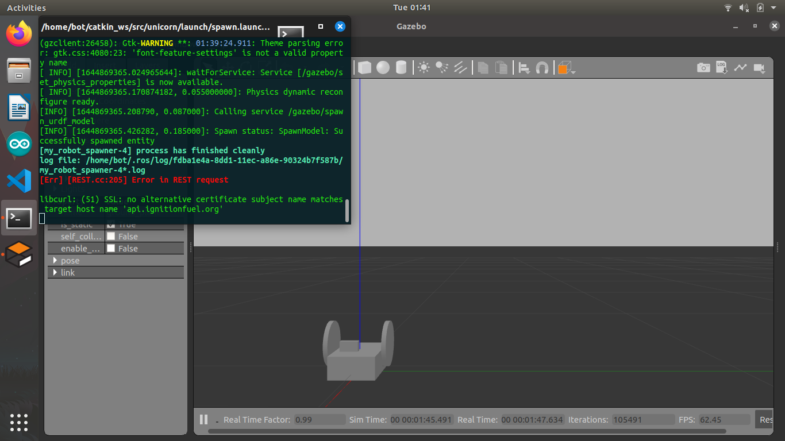

# ros_robot_botAlive
The repository will contain ROS programming and building of a robot from scratch.
#### For using this Repo :
```
cd catkin_ws/src
git clone https://github.com/theAkashDas/ros_robot_botAlive.git
catkin_make or catkin build
```

#### You can go to certain commits by : 
``` 
git log
git checkout <commit_hash>
```


### 1.0.0
- Added the URDF file for the robot
- Added the launch folder and launch file 
- For launching the empty gazebo world and the basic model : 
	`` roslaunch unicorn spawn.launch ``
#### Image :
 

### 1.0.1
- Added another link in the robot.urdf file named link_arm
- Added a continuous joint in between the two links
- For launching the empty gazebo world and the basic model : 
	`` roslaunch unicorn spawn.launch ``
#### Image :
 

### 1.0.2
- Added left and right wheels in robot.urdf file
- Added a scanner on the top of the robot.
- For launching the empty gazebo world and the basic model : 
	`` roslaunch unicorn spawn.launch ``
#### Image :
 
